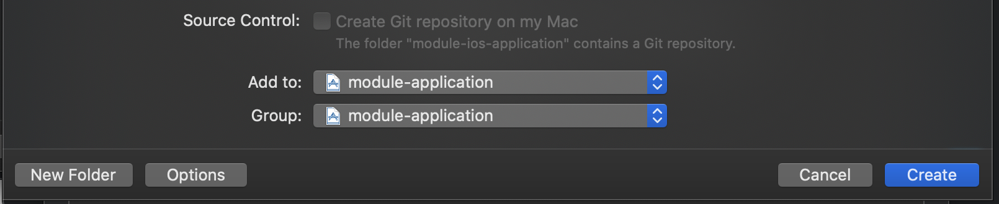
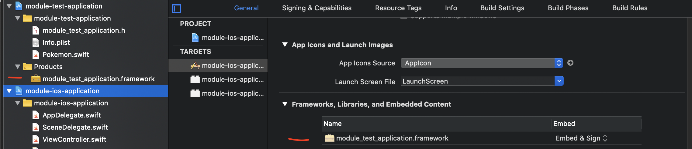

# Module iOS Application

## Description

A Swift Application that contains a Swift module/library that can be reused in many other projects.

## Contents

- [Setup Steps](#setup-steps)
- [How to run the project locally](#how-to-run-the-project-locally)
- [Tools](#tools)
- [Update Dependencies](#update-dependencies)
- [Releases](#releases)
- [Helpful resources](#helpful-resources)

## Setup Steps

**Important:** we cannot import another app in another app aka `Single View App` calling a `Single View App`.

To create an application with many module, first we need to create a new folder, then start Xcode and create a workspace by going `File > new > workspace` and call it   `module-application` and add it in the new folder you just created. 

Next, we want to create a project in the workspace we just created by going `File > new > project` and select `Single View App` and call it `module-ios-application`. Make sure it is added to `module-application`. See the image below.

<p></p>

Once that has been created, create a class in the `module-ios-application`, for example this class is Pokemon.

```swift
import Foundation

public class Pokemon {
    
    public init() {}
    
    public let region = "Johto"

}
```

Add the following to `AppDelegate.swift`, this is important as we will know it will work when we add this class as part of framework

```swift
func application(_ application: UIApplication, didFinishLaunchingWithOptions launchOptions: [UIApplication.LaunchOptionsKey: Any]?) -> Bool {
    // Override point for customization after application launch.
    let test = Pokemon().region
    print("hello \(test)")
    return true
}
```

To create a module/framework, we want to create a project in the workspace we just created by going `File > new > project` and select `framework` and call it `module-test-application`.  Make sure it is added to `module-application`. See the image below.

<p></p>

Now, carry over the data in Pokemon class to the framework project. After that has been added.

We go back to the `Single View App`, add drag the framework file into the `module-ios-application`. See the image below

<p></p>

## Tools

**Linter:** we use the following linter [link](https://github.com/github/super-linter).

**Uploading Artifacts:**  we use the following way to upload Artifacts, they allow you to persist data like test results after a job has completed, see the following documentation [link](https://docs.github.com/en/actions/configuring-and-managing-workflows/persisting-workflow-data-using-artifacts).

**Creating images/icons:** we use Figma to create images and icon. Figma makes it very easy to create designs in many different formats.

**Creating a Mock Server:** we use a mock server with Postman to quickly test apis, to see how to create a mock server, see the following video [link](https://www.youtube.com/watch?v=rJY8uUH2TIk). 

### Mobile Specific Tools:
 
**Fastlane:** Fastlane allows us to automate our development and release process [link](https://docs.fastlane.tools/).

**App Center:** App Center is used to distribute an app, making it very easy to test on a physical device by using a fastlane plugin [link](https://github.com/microsoft/fastlane-plugin-appcenter).

## Update Dependencies

**Npm:** How to update a npm package.
- [link](https://docs.npmjs.com/cli/update).

**Gemfile:** How to update a Gemfile package.
- [link](https://bundler.io/man/bundle-update.1.html#UPDATING-A-LIST-OF-GEMS).

## Releases

How to manage releases in a repository [link](https://help.github.com/en/github/administering-a-repository/managing-releases-in-a-repository). 

## Helpful resources

The following link provides helpful information video on how to setup a modules in Xcode
- [link](https://www.youtube.com/watch?v=O_GDggfzaMY).

The following link provides helpful information article on how to setup a modules in Xcode
- [link](https://www.raywenderlich.com/5109-creating-a-framework-for-ios#toc-anchor-001).

The following link provides helpful information on how to setup `structures` and `classes` in iOS
- [link](https://docs.swift.org/swift-book/LanguageGuide/ClassesAndStructures.html).

The following link provides helpful information on how to fix `initializer is inaccessible due to 'internal' protection level`
- [link](https://stackoverflow.com/a/40859332).

The following link provides helpful information on the differences between Framework, library, Package and Module
- [link](https://dev.to/hamza/framework-vs-library-vs-package-vs-module-the-debate-3jpp).
